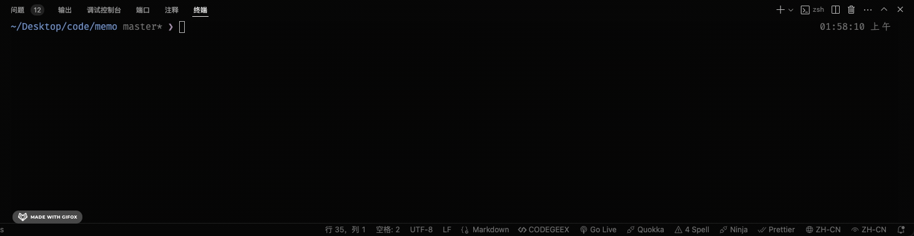

# 前端全栈开发框架

## 相关框架/组件
- [react18](https://reactjs.org/): 核心框架
- [typescript](https://www.typescriptlang.org/): 类型声明
- [vite5](https://cn.vitejs.dev/): 构建工具
- [tailwindcss](https://tailwindcss.com/): 原子化 css
- [shadcn](https://ui.shadcn.com/): 基于 tailwindcss 的无组件 UI 库
- [icon-pack](https://iconpark.oceanengine.com/official)：图表库
- [react-router-dom](https://reactrouter.com/en/main): 路由
- [axios](https://axios-http.com/docs/intro): 网络请求
- [Zustand](https://docs.pmnd.rs/zustand/getting-started/introduction): 轻量级的状态管理

# 特色
1. 使用[stylelint](https://stylelint.io/), [eslint](https://eslint.org/), [prettier](https://prettier.io/)进行代码规范化和格式化，
2. 使用 [commitlint](https://commitlint.js.org/)和[cz-git](https://cz-git.qbb.sh/zh/)规范和优化 commit 操作
3. 使用 [husky](https://typicode.github.io/husky/)的hooks对 commit 进行校验，并在之前执行代码的检查和格式化操作
4. 支持前端国际化，使用 `react-i18next` 作为前端国际化方案
5. 支持主题明暗的切换，已在 `main.tsx` 中引入，你只需要专注编写你的样式类，在需要切换的时候，使用`import { useTheme } from '@/components/ThemeProvider'` 或者在`localStorage`设置`theme`值即可，具体可查看`src/components/ThemeProvider/`组件的源代码

## 如何运行
使用 pnpm 包进行管理
```bash
npm install pnpm -g
pnpm install
```

## 如何使用
### 快速commit操作

```bash
pnpm run commit
```
> 如果你想修改 commit 规范，需要修改`commitlint.config.js`


## 后端
采用 [nestjs](https://docs.nestjs.com/)作为后端框架，正在开发中，支持的特色如下

- 用户鉴权
- TypeOrm集成的数据库操作
- 统一的响应封装
- 日志系统
- ...


## 未来计划
支持 [Tauri2.0](https://v2.tauri.app/blog/tauri-2-0-0-beta/) 进行跨端开发，一套代码可以支持 mac、windows、linux、macos、ios、android 平台

```js
function getName(name, age){
  const a = '12131'
  return 'Tauri'
}

<html>21213121</html>
```

