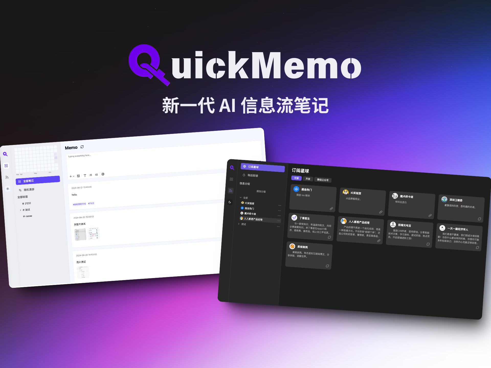
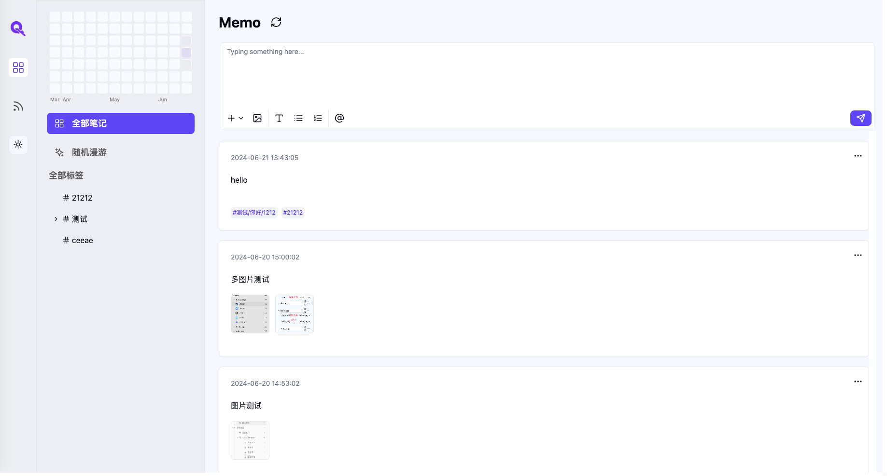
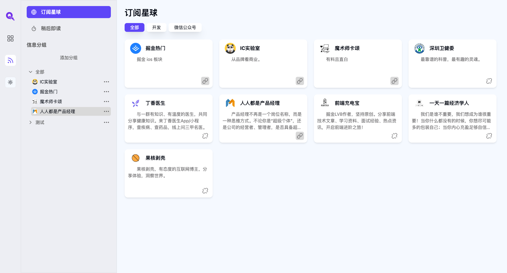
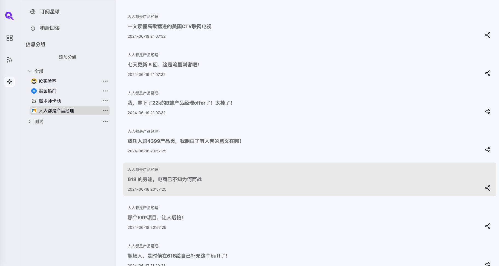
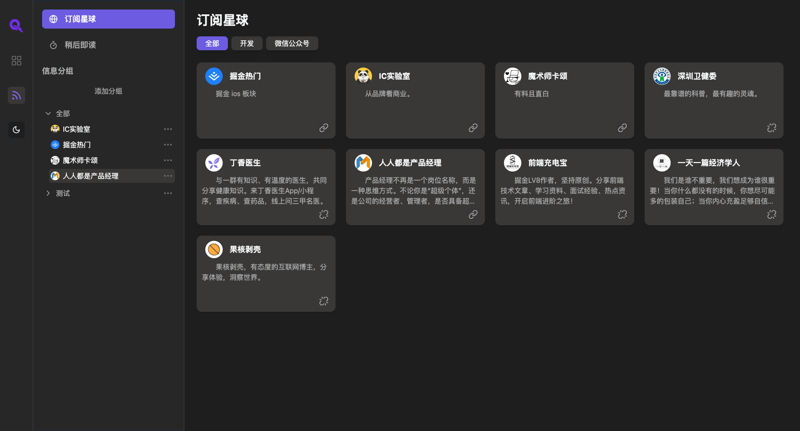
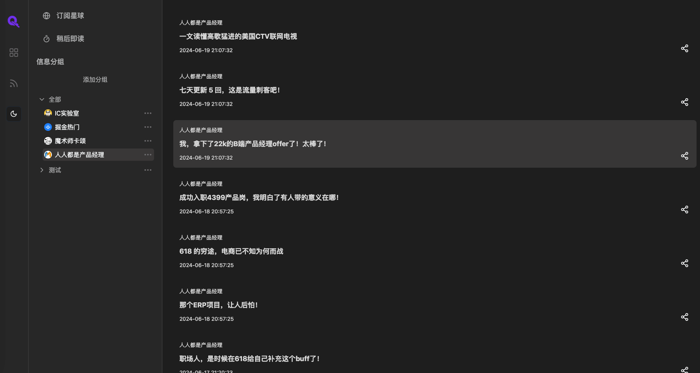

<h1 align="center">QuickMemo</h1>
<h3 align="center">新一代 AI 信息流笔记</h2>

## Banner

## Core
- React + Tailwindcss
- Nestjs + TypeORM

## Background

在这个信息充斥的时代，我们每个人都被无数的碎片化信息所包围。这些信息的来源五花八门，从抖音、B站、头条新闻等互联网平台，到我们生活中的亲朋好友、同事、老师，每一个角落都充满了信息的流动。它们以新闻、文章、视频等多种形式呈现，丰富而多样。

信息的来源不仅限于外界，还源自我们内心的思考与创造。无论是在街头漫步时的灵光一闪，还是沐浴时的突发奇想，这些瞬间的灵感都可能激发我们创作小说、撰写论文或开发产品。这些碎片化的信息，虽然看似杂乱无章，却蕴含着无限的价值。

设想一下，如果我们能够拥有一个超凡的记忆力，将所有这些有价值的信息一一保存，随时调用，那将是多么令人向往的能力。正是基于这样的愿景，我构思了一款卡片笔记应用。这款应用不仅能够帮助我们记录和收集日常生活中那些值得铭记的碎片信息，还能从互联网的海量信息中筛选、整理，成为我们的"第二大脑"。

这款产品它将每一个信息抽象为向量，借助AI，构建起我们的知识库，与 AI 进行对话从知识库中检索自己的知识。不仅如此，还能发现我们随手记录下的信息与其他信息之间的联系，在不知不觉间帮助我们构建起一个庞大的知识网络

## 功能演示
### Memo卡片

Memo是这个产品的核心功能，你可以理解为一个个的卡片，每个卡片的来源可能是你的突然想到的 Idea，也可能是你从网络中收集到的有价值的信息。

- 每个 memo 支持打上标签
- 支持为 memo 添加图片
- 支持为 memo 添加链接

### 信息源订阅

信息源订阅是这个产品的另一个核心功能，你可以订阅比如知乎、B站、抖音等，你可以订阅你感兴趣的信息源，并实时获取最新的信息。

- 支持订阅微信公众号
- 支持订阅各种常见的互联网信息平台，例如知乎、B站

### 信息源阅读

订阅了信息源后，可以在分组处查看信息

### 相关笔记 && AI 知识库

正在开发中...

## 黑暗模式

 

## 后续开发工作
> 非常抱歉，目前这个项目进度是 80%，因为开发只有一个人，同时干前后端，进度较慢，最近我要期末考试了，所以这个项目暂时搁置了，后续会继续开发，预计 7 月完成，这里先开源出来，有兴趣的可以关注
1. 开发相关笔记和 AI 知识库功能
2. 完善 memo 页面
3. 开发浏览器插件，支持快速订阅，支持阅读信息源时调用 AI，支持文章 AI 总结，支持查看文章和已有笔记的关联

## 作者

- 佳豪：
  - 个人使用说明书： [https://uastpsddr4c.feishu.cn/docx/IF7HdqQswo8t3qxxix3c7sPXnHe](https://uastpsddr4c.feishu.cn/docx/IF7HdqQswo8t3qxxix3c7sPXnHe)
  - 即刻：[佳豪 jiahao](https://m.okjike.com/users/d321ec82-1a13-4cac-a747-18843fd37bf0)
  - Bilibili: [佳豪君 z](https://space.bilibili.com/67268239)
  - 推特：[Mrlaijiahao](https://x.com/Mrlaijiahao)
  - 开发、产品 
  - 大二 会计学  

- 子豪
  - 产品、UI 
  - 大二 英语专业 

## 其他
项目开发不易，给项目一个 Star 吧！

- 后端地址：[https://github.com/kjhuanhao/quickmemo-backend](https://github.com/kjhuanhao/quickmemo-backend)